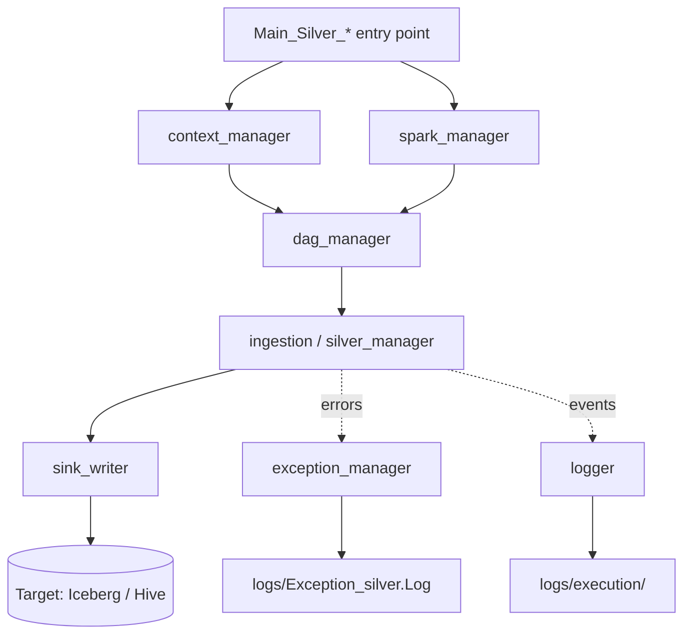

# CatalystCore

A modular PySpark framework for orchestrating SQL-based data pipelines, built around metadata-driven processing of medallion-layered data models.

CatalystCore reads JSON metadata describing your data model, resolves a DAG of SQL transformations, and executes them on Spark. Each concern — Spark session management, DAG resolution, ingestion, silver-layer processing, exception handling, sink writing — is isolated in its own module, so the framework scales from a single table to thousands without changing orchestration code.

---

## Features

- **Metadata-driven** — data models, dependencies, and execution plans live in JSON under `metadata/`
- **Medallion-aware** — first-class support for ingestion (`i_phase`), historisation (`h_phase`), and gold (`gold_*`) layers
- **Modular managers** — Spark, DAG, ingestion, logging, exceptions, and sinks are each their own component
- **Multi-tenant by design** — data models are scoped by country and entity (e.g. `Maroc/SAHAM_BANK/`)
- **Reprise / recovery** — built-in replay of failed runs via `reprise_silver.py`
- **Multiple execution modes** — full DAG, single unit, or nested-folder traversal

---

## Repository Structure

```
catalystcore/
├── apps/
│   └── SPM/                              # Silver Processing Manager
│       └── src/
│           ├── context_manager/          # Run context & parameters
│           ├── dag_manager/              # DAG resolution & topological execution
│           ├── exception_manager/        # Error classification & propagation
│           ├── ingestion/                # Source ingestion logic
│           ├── logger/                   # Structured logging utilities
│           ├── silver_manager/           # Silver-layer transformations
│           ├── sink_writer/              # Iceberg / Hive / target writers
│           ├── spark_manager/            # Spark session lifecycle
│           ├── utils/                    # Shared helpers
│           ├── Executor.py               # Generic executor
│           ├── Executor_nested_folders.py# Traversal of nested metadata
│           ├── Main_Silver_Manager.py    # Full silver run entry point
│           ├── Main_Silver_Unit.py       # Single-unit silver run entry point
│           └── reprise_silver.py         # Replay / recovery entry point
│
├── config/
│   └── shared_config.json                # Cross-app configuration
│
├── logs/
│   ├── execution/                        # Per-run execution logs
│   ├── Exception_silver.Log              # Silver-layer exceptions
│   └── exceptions.log                    # Global exception log
│
├── metadata/
│   └── data_models/
│       └── models/
│           └── <country>/                # e.g. Maroc
│               └── <entity>/             # e.g. SAHAM_BANK
│                   ├── gold_<domain>/    # Gold layer (compliance, finance, risk, …)
│                   ├── h_phase[_<v>]/    # Historisation phase
│                   └── i_phase[_<v>]/    # Ingestion / extraction phase
│
└── README.md
```

---

## Architecture



Each `Main_*` entry point wires the managers together: `context_manager` resolves run parameters, `spark_manager` opens the Spark session, `dag_manager` builds the execution graph from `metadata/`, and the silver/ingestion managers apply SQL transformations. Outputs flow through `sink_writer`; failures are captured by `exception_manager` and persisted by `logger`.

---

## Data Model Conventions

Each table lives under:

```
metadata/data_models/models/<country>/<entity>/<table_name>/
```

Table-name prefixes carry meaning:

| Prefix    | Layer / Role                                | Example                     |
|-----------|---------------------------------------------|-----------------------------|
| `i_phase` | Ingestion / extraction (raw → silver)       | `i_phase_AS2`               |
| `h_phase` | Historisation (SCD Type 2)                  | `h_phase_AS3`               |
| `gold_*`  | Gold layer, organised by business domain    | `gold_finance`, `gold_risk` |

Suffixes:
- `_tmp` — temporary / intermediate tables
- `_AS`, `_AS2`, `_AS3` — variants for alternate scenarios

---

## Prerequisites

- Python 3.9+
- Apache Spark 3.4+
- Access to a Hive Metastore and/or Iceberg catalogue
- Credentials for the source systems referenced in `metadata/`

---

## Installation

```bash
git clone <repo-url>
cd catalystcore
pip install -r requirements.txt
```

---

## Configuration

Global runtime parameters live in `config/shared_config.json`:

- Spark session settings (master, executor resources, packages)
- Catalogue and metastore endpoints
- Source / target connection details
- Logging and exception-handling defaults

Per-table parameters (schema, partitioning, SQL, dependencies) live in each table's folder under `metadata/data_models/models/<country>/<entity>/<table>/`.

---

## Running a Pipeline

### Full silver-layer run (managed DAG over all tables)

```bash
python apps/SPM/src/Main_Silver_Manager.py
```

### Single-unit run (one table / one phase)

```bash
python apps/SPM/src/Main_Silver_Unit.py --table <table_name>
```

### Reprise / recovery of a failed run

```bash
python apps/SPM/src/reprise_silver.py --run-id <run_id>
```

### Generic / nested executors

```bash
python apps/SPM/src/Executor.py
python apps/SPM/src/Executor_nested_folders.py
```

> Replace the placeholder flags with the actual CLI signatures of each script.

---

## Logging

All runs write to `logs/`:

- **`logs/execution/`** — per-run execution traces (DAG resolution, step timings, row counts)
- **`logs/Exception_silver.Log`** — silver-layer exceptions
- **`logs/exceptions.log`** — global exceptions across all components

Exceptions are classified by `exception_manager/` before being logged, so downstream alerting can filter by severity and component.

---

## Adding a New Table

1. Create the metadata folder:
   ```
   metadata/data_models/models/<country>/<entity>/<new_table>/
   ```
2. Add the table's JSON spec (schema, source, SQL, dependencies) inside that folder
3. Validate locally with:
   ```bash
   python apps/SPM/src/Main_Silver_Unit.py --table <new_table>
   ```
4. Once green, the next full run picks it up automatically

---

## Development

- Modules under `apps/SPM/src/` follow a manager pattern: each handles one concern and exposes a small public API
- New processing layers (e.g. a future `GPM` for gold, `IPM` for ingestion) should sit alongside `SPM` under `apps/`
- Lint your SparkSQL with [`sparksql-lint`](#) before committing (recommended pre-commit hook)

---

## Roadmap

- [ ] Parallel execution of independent DAG branches
- [ ] Web UI for DAG visualisation
- [ ] Native Airflow operator (`CatalystCoreOperator`)
- [ ] Dedicated `GPM` (Gold Processing Manager) app

---

## License

Internal — *(set this to your organisation's policy)*.
